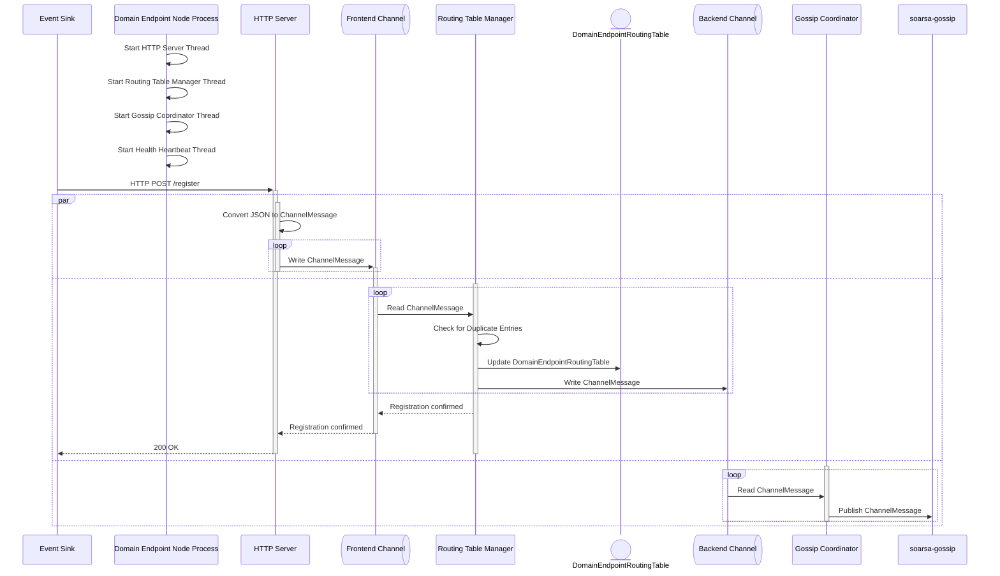
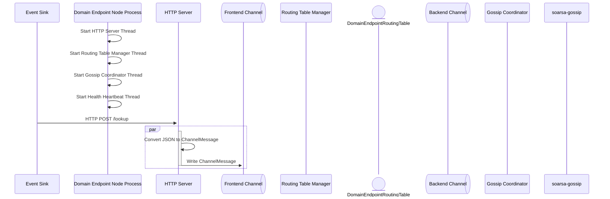

# Product Requirements Document (PRD): Domain Endpoint Resolver

## 1. System Objective
To build a fault-tolerant, resilient and scalable Rust-based distributed mesh network for event domain endpoint discovery. An event sink, or router, can register the listeners that it binds to for incoming event data as well as registering its health check URI with a mesh node. An event source, or router can query a mesh network node for the endpoint IP address and port of a particular domain. Each node in the mesh will store the domains and their listener and health check endpoints as part of a local routing table. The registered domains and their listening addresses and health checks must be propagated through the mesh network. The integrity of the domain endpoint data is of critical importance, consequently, each mesh node, should on a periodic basis call the health check endpoints, and remove any domain/endpoints from its local routing table. Changes to the node routing table should be pushed into the mesh, following a Change Data Capture (CDC) pattern. Routing information is disseminated across mesh nodes using the HyParView membership protocol over gossip. Event sinks register what they can receive; event sources resolve where to send.

## 2. Architectural Elements

The following diagram defines the structural element and communication paths between the elements that constitutes a Domain Endpoint Node.


1. **HTTP Server** execution thread using tokio-quiche that exposes four HTTP routes as an API surface. There are:
   - ```/register```
   - ```/health```
   - ```/lookup```
   - ```/update```
   - ```/remove```

    This thread communicates with downstream threads via a channel.

2. **Domain Endpoint Node Routing Table**, which is a dictionary of endpoint data, where the key of the dictionary is the fully qualified domain name, and the value is an array or list of endpoint and health data.

3. **Routing Table Manager**, an execution thread that will consume messages from the HTTP/3 thread via a channel, and them make updates to the **Domain Endpoint Node Routing Table** based on the HTTP REST Verb and route. 

    This thread communicates with downstream threads via a channel.
  
4. **Gossip Coordinator** an execution thread responsible for communicating routing table changes from the **Routing Table Manager** to other Domain Endpoint Nodes in the mesh. It is also responsible for communicating mesh changes an updates back to **Routing Table Manager**.
Communication with the **Routing Table Manager** thread is done via a channel. 

1. **Health Heartbeat** an execution thread, that is responsible for making HTTP health check for all of the locally scoped healthCheck entries in the **Domain Endpoint Node Routing Table**. This thread will communicate health check changes with the **Routing Table Manager** using the same channel that the **HTTP Server** thread uses.

## 3. Technology Stack

- Use HyParView and PlumTree to gossip and propagate node data within the mesh network.

- **Primary Language**: 
  - Rust
  - Strict adherence to idiomatic error handling
  - There should be no ```.unwrap()``` function calls in production code

- **Communication Protocol**:
  - HTTP/3 with fall back to HTTP/2

- **Key Rust Crate Dependencies**:
  - saorsa-gossip
  - clap
  - quiche + tokio-quiche
  - rmp
  - tracing
  - serde
  - url

## 4. Functional Requirements

### Requirement 1 - Channel Data Structure

The following enum and data structure define the structure of what will be written to an read from the backend and frontend channels. Unless otherwise stated, these data structure definitions should be used for both inter and intra process communications. 

#### Rust Data Structures
```rust
use serde::{Deserialize, Serialize};
use url::Url;

#[derive(Debug, Serialize, Deserialize)]
#[serde(rename_all = "camelCase")]
pub struct DomainUri {
    pub listener: Url,
    pub health_check: Url,
}

#[derive(Debug, Serialize, Deserialize)]
#[serde(rename_all = "camelCase")]
pub struct DomainConfig {
    pub domain_name: String,
    pub domain_uris: Vec<DomainUri>,
}
      
pub type DomainEndpoints = Vec<DomainConfig>;

#[derive(Debug, Serialize, Deserialize)]
#[serde(rename_all = "camelCase")]
pub struct AddMessage {
    pub domain_endpoints: DomainEndpoints,
}

#[derive(Debug, Serialize, Deserialize)]
#[serde(rename_all = "camelCase")]
pub struct RemoveMessage {
    pub domain: String,
    pub listener: Url,
    pub health_check: Url,
}

#[derive(Debug, Serialize, Deserialize)]
#[serde(rename_all = "camelCase")]
pub struct UpdateMessage {
    pub domain: String,
    pub listener: Url,
    pub health_check: Url,
    pub health_status: String,
}

#[derive(Debug, Serialize, Deserialize)]
#[serde(rename_all = "camelCase")]
pub struct LookupMessage {
    pub domain: String,
}

#[derive(Debug, Serialize, Deserialize)]
#[serde(rename_all = "camelCase")]
pub struct ResultMessage {
    pub domain_endpoints: DomainEndpoints,
}

#[derive(Debug, Serialize, Deserialize)]
#[serde(tag = "messageType", rename_all = "camelCase")]
pub enum ChannelMessage {
    Add(AddMessage),
    Remove(RemoveMessage),
    Update(UpdateMessage),
    Lookup(LookupMessage),
    Result(ResultMessage),
}
```

### Requirement 2 - Data Serialization
- Data All data sent to and from the **HTTP Server** must be serialized and deserialized into a binary format using messagepack.

- All data sent from a mesh node to a event sink or router must not be serialized with messagepack.

### Requirement 3 - Encrypted Payload
- The system must provide the ability to encrypt the payload data whilst in transit over a network, primarily between an Event Sink/Router or and the **HTTP Server**. The system will provide a command line argument specifying the certificate and key that is to be used in encrypting payload data. To be used by HTTP/3 or HTTP/2 Fallback TLS 1.3 or greater.

### Requirement 4 - Domain Endpoint Routing Table:
The Domain Endpoint Node Routing Table is an in-memory data store with no persistence capabilities. 

Use the following Rust code snippet to represent the in-memory data store:

```rust
use std::collections::HashMap;
use serde::{Deserialize, Serialize};
use url::Url;

#[derive(Debug, Serialize, Deserialize)]
#[serde(rename_all = "camelCase")]
pub struct RoutingTableData {
    pub listener: Url,
    pub health_check: Url,
    pub health_counter: i32,
    pub health_status: String,
    pub is_local_entry: bool,
}

// Type alias representing the dictionary of domain names to their records
pub type DomainEndpointRoutingTable = HashMap<String, Vec<RoutingTableData>>;
```

Outlined below is a JSON example of what the payload of the routing table could be.

```json
    {
        "starfoods.food@v1" : [
          {
            "listener" : "https://domain1:5050",
            "healthCheck" : "https://domain1:5076",
            "healthCounter" : 0,
            "healthStatus" : "healthy",
            "isLocalEntry" : true
          },
          {
            "listener" : "https://domain1:5051",
            "healthCheck" : "https://domain1:5077",
            "healthCounter" : 0,
            "healthStatus" : "degraded",
            "isLocalEntry" : true
          }
        ],
        "starfoods.quality@v1": [
          {
            "listener" : "https://domain2:5060",
            "healthCheck" : "https://domain2:5061",
            "healthCounter" : 0,
            "healthStatus" : "failed",
            "isLocalEntry" : true
          },
          {
            "listener" : "https://domain3:5080",
            "healthCheck" : "https://domain3:5081",
            "healthCounter" : 0,
            "healthStatus" : "healthy",
            "isLocalEntry" : false
          }
        ]
    }
```

- The ```DomainEndpointRoutingTable``` must only be updated or changed by the **Routing Table Manager** thread, however the **Health Heartbeat** thread will need to have read access to the ```DomainEndpointRoutingTable```. This means that both threads will need a reference to the ```DomainEndpointRoutingTable```. For the **Health Heartbeat** thread this is read-only access whereas for the **Routing Table Manager** it needs to read/write access.

- The lifetime of the ``DomainEndpointRoutingTable`` is that of the **Domain Endpoint Node**, consequently, the routing table is ephemeral and lives for the duration of the **Domain Endpoint Node**.

### Requirement 5 - Event Sink
An Event Sink interacts with the Domain Endpoint or Mesh Node via a REST API. 
These are:
   - ```/register```
   - ```/health```
   - ```/lookup```
   - ```/remove```
   - ```/update```

#### Requirement 5.1 - Endpoint Registration:

When an Event Sink wished to be discovered by the mesh network, it needs to register its listening and health check URI's and the domains that it can accept event messages for.

- An Event Sink will register the domains, by calling the ```/register``` for an IP Address/Port of a Domain Endpoint Node. The ```/register``` endpoint is an HTTP POST.

- The data must be serialized using messagepack before it is posted to the ```/register``` route.

    An example JSON payload before being serialized into messagepack format:

    ```json
    [
      {
          "domainName" : "starfoods.food@v1",
          "domainUris" : [
            {
              "listener" : "https://domain1:5050",
              "healthCheck" : "https://domain1:5076"
            },
            {
              "listener" : "https://domain1:5051",
              "healthCheck" : "https://domain1:5077"
            }
          ]
      },
      {
          "domainName" : "starfoods.quality@v1",
          "domainUris" : [
            {
              "listener" : "https://domain2:5060",
              "healthCheck" : "https://domain2:5061"
            },
            {
              "listener" : "https://domain3:5080",
              "healthCheck" : "https://domain3:5081"
            }
          ]
        }
    ]
    ```

#### Requirement 5.2 - Domain Lookup
When an Event Router or Sink needs to obtain the IP Address/Port for a specific domain, it needs t query the mesh network through one of the Domain Endpoint Nodes in the mesh by calling the ```/lookup``` API. The lookup API

- The **Event Sink/Router** will query for a domain by issuing a HTTP GET request. If for example, the event router wanted to know the IP Address/Port for the **starfoods.quality@v1** domain, issue a HTTP GET request against the Domain Endpoint Node's HTTP server address, using the following parameters : ```/lookup?domain=starfoods.quality@v1```.

- If the domain is found in the mesh network, then the following json payload will be returned to the **Event Sink/Router**:

```json
{
  "domainName" : "starfoods.quality@v1",
  "domainUris" : [
      {
        "listener" : "https://domain2:5060",
        "healthCheck" : "https://domain2:5061"
      },
      {
      "listener" : "https://domain3:5080",
      "healthCheck" : "https://domain3:5081"
      }
  ]
}
```
- If the domain is not found then the following json payload will return an empty list of domainURI's to the **Event Sink/Router**:

```json
{
  "domainName" : "starfoods.quality@v1",
  "domainUris" : []
}
```

#### Requirement 5.3 - Domain Removal

#### Requirement 5.4 - Health Check

### Requirement 6 - HTTP Server

This thread "listens" for inbound HTTP requests on an IP Address/Port that is specified on the command line.

#### Requirement 6.1 - Endpoint Registration:
- The **HTTP Server** thread will provide a ```/register``` API route, that will allow an event sink or event router to register listener and healthCheck endpoint information for a domain in the Mesh.

- An event sink can register multiple domains, where each domain must contain one or more listeners and health check URI. 

- The **HTTP Server** thread needs to ensure that appropriate URL encoding is done to the HTTP POST request.

- Upon receipt of HTTP POST message, the **HTTP Server** thread will convert the incoming messagepack formatted data to the ```DomainEndpoints``` Data Transfer Object (DTO) defined above. 
  
- The **Routing Table Manager** will read the ```DomainEndpoints``` data from the frontend channel.

- The **Routing Table Manager** will update the ```DomainEndpointRoutingTable``` with the domain registration data, ensuring that no duplicates exists within the ```DomainEndpointRoutingTable```.
  
- The **Routing Table Manager** will write the ```DomainEndpoints``` data to the backend channel.

- The **Gossip Coordinator** will read the ```DomainEndpoints``` data from the backend channel.

- The **Gossip Coordinator** will iterate through the list of domains and their domainURI's and publish each domains data to ```saorsa-gossip``` where the ```saorsa-gossip``` will ensure that duplicate domains are merged if the ```listener``` and ```health_check``` do not already exist in the mesh, otherwise the duplicate value is discarded.

#### Register Sequence Diagram


#### Requirement 6.2 - Domain Lookup

- The **HTTP Server** thread will provide a ```/lookup``` route to enable an event sink or event router to query the mesh node to look up the endpoint address or addresses for a given domain.

- The **HTTP Server** thread needs to ensure that appropriate URL encoding is done to the HTTP GET request.

- The **HTTP Server** will write the following data payload to the frontend channel upon receiving a HTTP GET request: ```/lookup?domain=starfoods.quality@v1```.

  ```json
  {
    "origin" : "Http",
    "action" : "Lookup",
    "domain" : "starfoods.food@v1",
    "listener" : "",
    "healthCheck" : "",
    "healthStatus" : ""
  }
  ```

- Upon receipt of a response from the frontend channel the **HTTP Server** will format a response to the HTTP GET request. 

- A successful response will return a JSON payload resembling the following structure and a HTTP Status code of 200:
    ```json
    {
        "domain" : "starfoods.quality@v1",
        "endpoints" : [
            "https://domain3:5060",
            "https://domain4:5080"
        ]
    }
    ```
- A response that contains no endpoints will return a JSON payload resembling the following structure and a HTTP Status code of 404:
    ```json
    {
        "domain" : "starfoods.quality@v1",
        "endpoints" : [
        ]
    }
    ```
#### Lookup Sequence Diagram



#### Requirement 6.3 - Domain Removal
- The **HTTP Server** thread will provide a ```/remove``` route, that will allow an event sink or event router to instruct the **Routing Table Manager** to remove a domain name and associated listener endpoints from it's local Routing Table or from the mesh.
  
The HTTP ```DELETE /remove?domain=starfoods.quality@v1&listener=https://domain1:5050&healthCheck=https://domain1:5076```
- The removal is based a tuple containing (domain, listener, healthCheck) as part of the ```/remove``` URL. All three values in the request must be an exact match to an entry in the **Domain Endpoint Routing Table** in order for it to be removed.

- The **HTTP Server** thread needs to ensure that appropriate URL encoding is done to the HTTP DELETE request.

- The **HTTP Server** will write the following data payload to the frontend channel upon receiving a  HTTP DELETE ```/remove``` request.  

    ```json
    {
        "origin" : "HTTP",
        "action" : "DELETE",
        "domain" : "starfoods.quality@v1",
        "listener" : "https://domain3:5080",
        "healthCheck" : "https://domain3:5081",
        "healthStatus" : ""
    }
    ```

#### Requirement 6.4 - Health Check
- The **HTTP Server** will provide a ```/health``` route, that will allow an external process to determine the health status of a Domain Endpoint Node.
- The HTTP Server thread needs to ensure that appropriate URL encoding is done to the HTTP GET request.

- A health state should return a HTTP Status code of 200 and a JSON response body structured like this:

    ```json
    {
      "ok": true,
      "status": "healthy"
    }
    ```

### Requirement 7 - Routing Table Manager

It is possible to have two event sinks listening for events for the same domain. In the mesh network there should be single representation of all domain nodes and they respective health checks.

- When two or more event sinks register the same domain concurrently, they will have different health check URI's and listener IP Address/Port. The system will merge the the two domain entries, by removing duplicates from the ```domainUris``` array by matching on the ```{ listener, healCheck }``` pair.

- Given that there could be multiple "listener" and "healthCheck" URI's for a given domain, when a healthCheck fails, the healthCheck's corresponding listener and healthCheck URI should be removed from the list of "domainUris" URI's for the given domain. There is a 1:1 relationship between the "listener" URI and it's healthCheck endpoint. When the healthCheck is removed because of a failure, so should the listener entry for that healthCheck.

### Requirement 8 - Gossip Coordinator


### Requirement 8 - Health Heartbeat


### Requirement 10 - Health Check
- On a user specified periodic basis, via a command line parameter setting, the mesh node should make a call to the health check URI's that was provided as part or the ```/Register``` call, to determine if the event sink or router is healthy. If the event sink or router returns an unhealthy state, the mesh node should remove the endpoint for the domain it belongs to.

- The healthy endpoint should return an HTTP Status code of 200 and the response body text should contain the text "healthy". An unhealthy endpoint should return an HTTP status code 503, and the text "unhealthy" in the response body.

- Given that there could be two or more concurrent registrations for a domain, and that these need to be merged and propagated back into the network. It is important that every healthCheck URI is called for a domain. If a domain has two different healthCheck URI's (after a merge) then the mesh should call both healthCheck URI's.

- When a health check fails for a {listener, healthCheck} pair, it should not immediately be removed from the list of "domainUris". A numeric integer counter for the number of retries should be associated with each pair, staring with a value of zero. A user specified threshold for the maximum number of retries must be specified as a command line parameter. When an "unhealthy" status is returned from the health check, then the counter is increased by one. When the counter is either equal to or exceeds the maximum number of retries, then it is to be removed from the "domainUris" list. When a counter for a {listener, healthCheck} pair is greater than zero but has not exceeded the maximum number of retries value, and a health check returns "healthy", then the counter for the pair must be reset to zero.
  
### Requirement 11 - Logging
- The system should log data when:
  1.  an event sink registers with the mesh network. It should log:
      - the action being performed which is "Registration"
      - source IP/Port of the registering node
      - the domain that it is registering
      - the list of listener URI's
      - the list of healthChecks URI's
  2. an event sink does a lookup. It should log:
      - the action being performed which is "Lookup"
      - the name of the domain it is looking for
      - whether or not the lookup was successful, by logging the listener endpoint URI's
  3. an event sink does a remove. It should log:
      - the action being performed which is "Remove"
      - the name of the domain it removing

## 5. System Interaction
<<Sequence Diagrams>>

## 6. Out of Scope (Negative Constraints)
- Event Router and Event Sink implementations
- Do NOT implement persistent database storage this service only routes data
- The management interface into the mesh is out of scope
- The ability to retrieve all domain endpoints from the mesh is out of scope

## 7. Core Domain Entities
- **Event Sink:** A process that listens on an IP/Port address for incoming event data. The processing of the event itself is determined by the purpose of the event sink. For example, an event sink could receive incoming event messages and persist them to a Kafka topic. 

- **Event Router:** Is an event sink, that will listen for incoming event data on and IP/Port. The event will be processed by the ruleset defined for that router.

- **Event Source:** A process that generates event data and will transmit event data to an event sink or event router.

- **Endpoint:** Is either an IPv4 or IPv6 address inclusive of the port. The endpoint contains an actual IP address and Port.

## 8. Error Handling & Edge Cases
