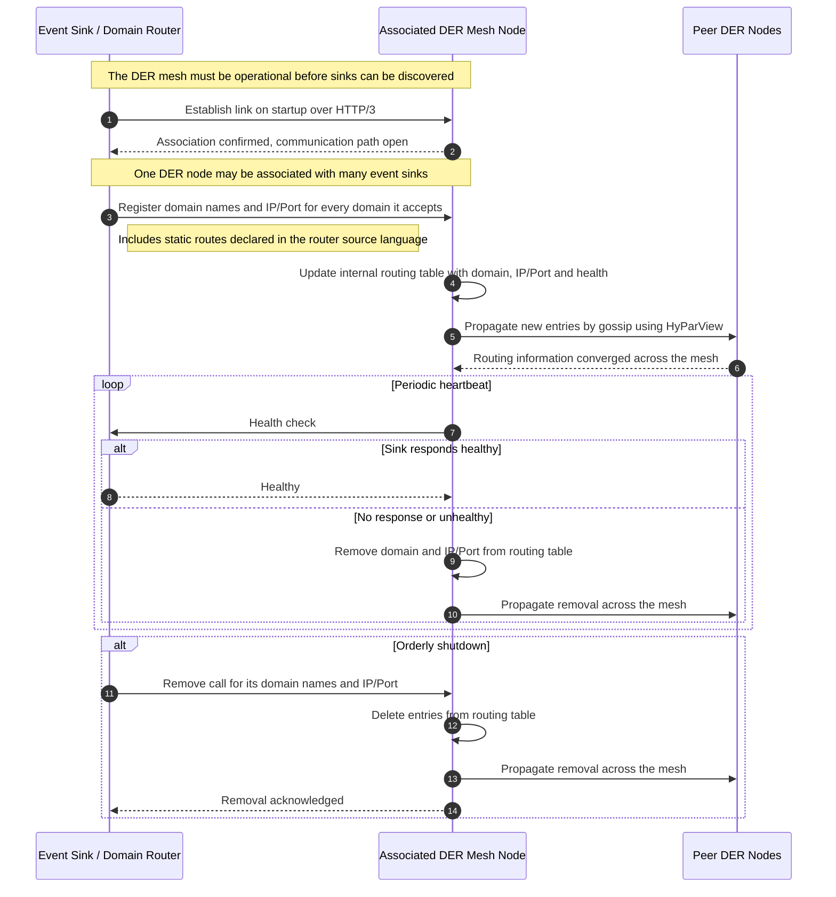
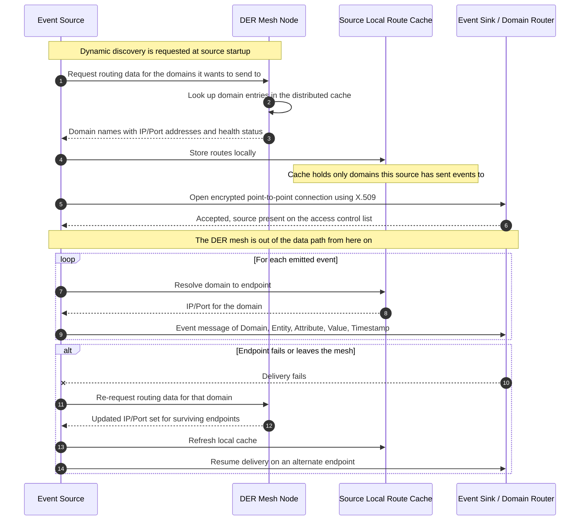

# DER Sequence Diagrams

Interaction sequences for the **Domain Endpoint Resolver (DER)** mesh described in
*Technical Brief: Event Network Architecture (ENA)* — Layer 9 Labs LLC.

The DER mesh is a distributed cache of domain names, their IP/Port addresses, and endpoint
health status. Routing information is disseminated across DER nodes using the HyParView
membership protocol over gossip. Event **sinks** *register* what they can receive; event
**sources** *resolve* where to send.

---

## 1. Event Sink ↔ DER Node

An event sink (or event router acting as a sink) registers the domains it accepts events for,
is health-checked by its associated DER node, and is removed from the mesh on shutdown or
failure.

**Notes**

- The sink's programmable-interface registration is what makes it discoverable — no central broker holds the table.
- Every DER node acts as an element of the distributed cache rather than a replica of a central routing table.
- Removal happens two ways: an explicit `remove` call during orderly shutdown, or an unhealthy heartbeat result.

---

## 2. Event Source ↔ DER Node

An event source resolves the domains it intends to send to, caches those routes locally, and
then talks point-to-point with the event sink. The DER mesh is not in the data path.

**Notes**

- Decoupling is the point: an event sink never needs to know which event source will send to it. The association is managed dynamically by the DER mesh.
- A source caches only the domains it actually uses, keeping the local footprint small enough for microcontrollers and single-board computers.
- Static endpoint definitions and dynamic discovery can coexist — a source may use both.
- Broadcast is the default behaviour for an event source, so one resolved domain may map to several sink endpoints for redundancy.

---

*Source: Technical Brief — Event Network Architecture (ENA), sections 7.1 Domain Endpoint
Resolver (DER), 7.2 Event Network and Sidecars, and 7.3 Dynamic Discovery.*
